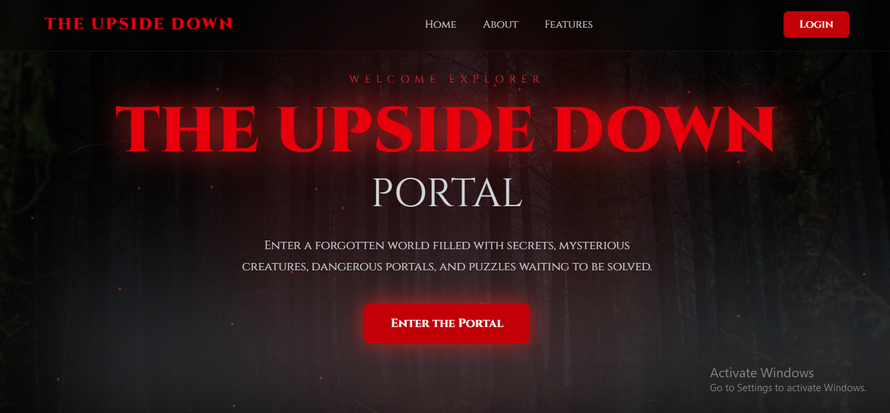
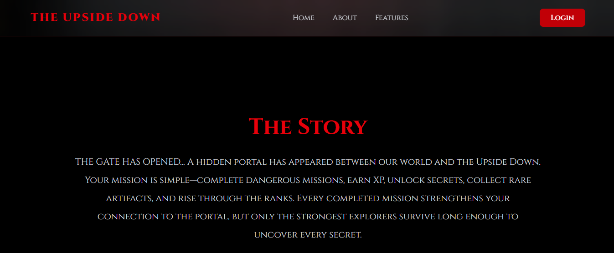
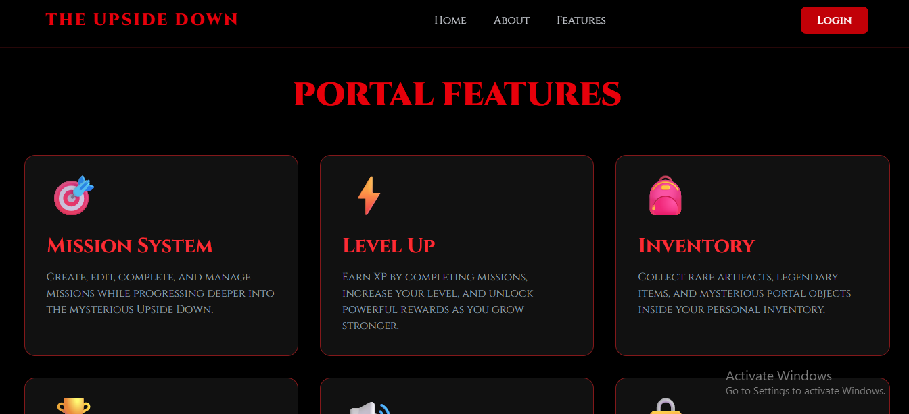
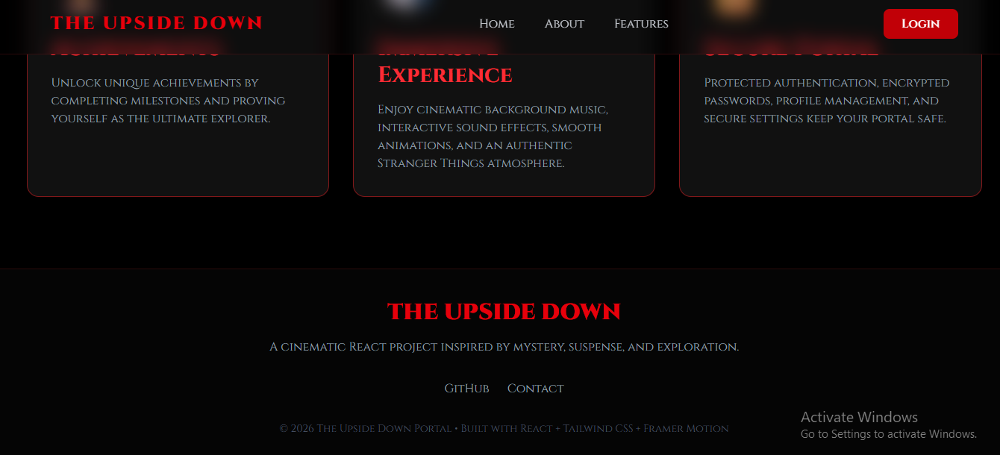
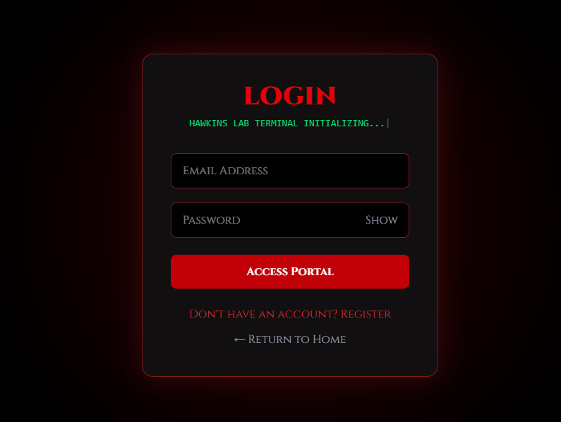
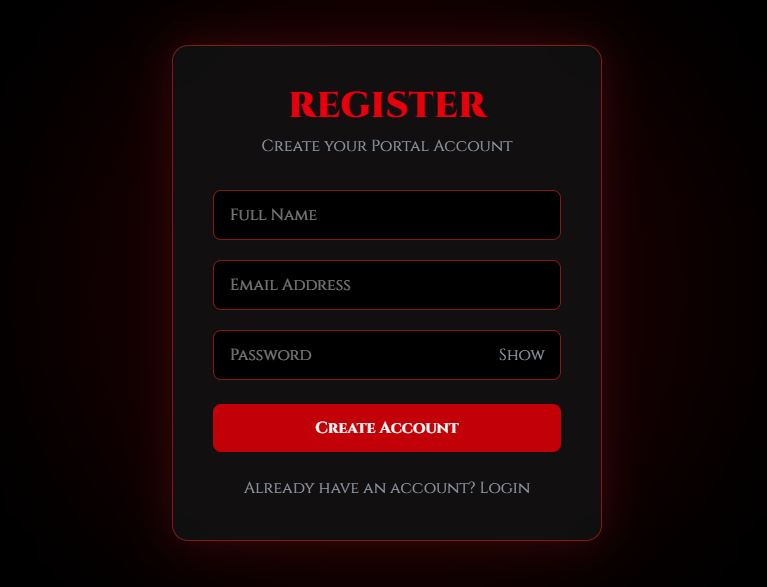
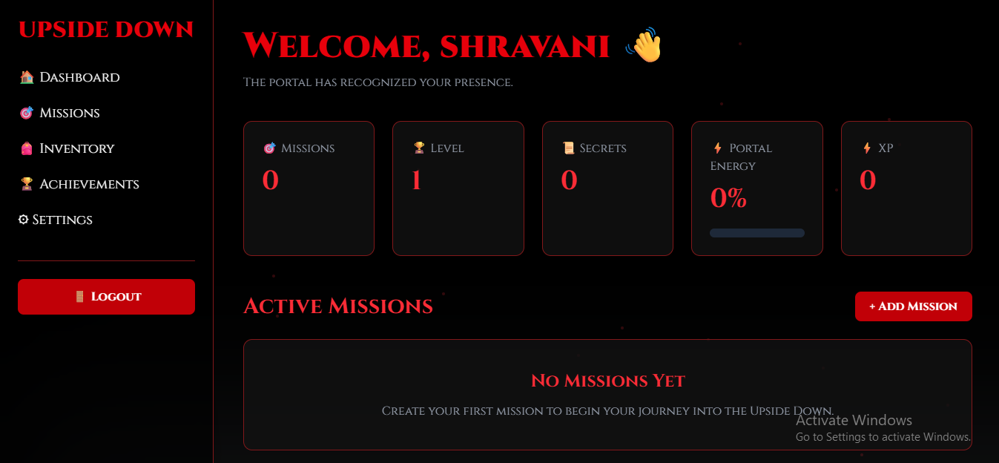
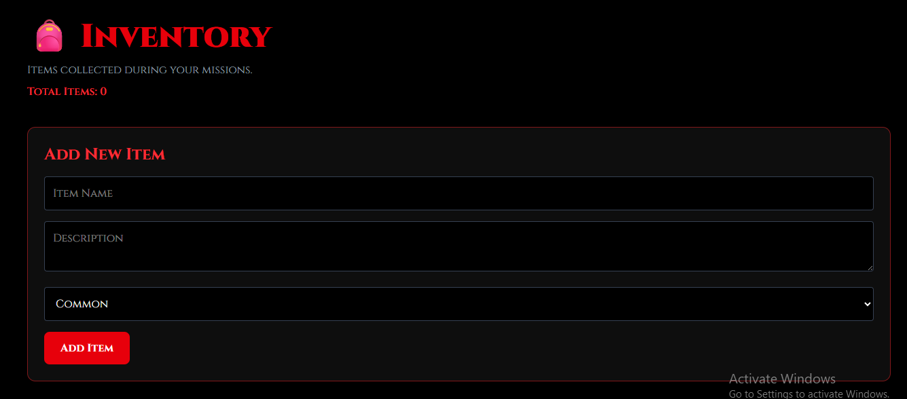
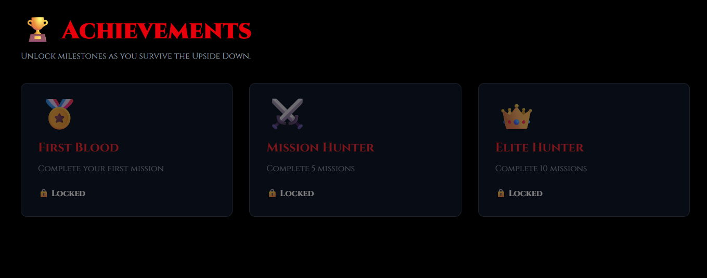

🌌 The Upside Down Portal

«A Stranger Things-inspired full-stack MERN web experience that transforms task management into an immersive mission-based adventure.»


---

🚀 Live Demo

🌐 Live Application:
https://the-upside-down-portal-1.onrender.com

💻 GitHub Repository:
https://github.com/salunkheshravani32-pixel/the-upside-down-portal

---

📖 About The Project

The Upside Down Portal is an immersive full-stack web application inspired by the mysterious atmosphere of the Stranger Things universe.

Instead of managing ordinary tasks, users enter an interactive mission-based environment where they can complete missions, unlock achievements, manage inventory items, and track their progress.

The project combines a modern React frontend with a Node.js + Express backend and MongoDB database, creating a complete full-stack application with authentication and persistent user data.

---

✨ Features

🔐 Authentication

- User registration
- Secure login
- Password hashing with bcrypt
- JWT-based authentication
- Protected API routes

🎯 Mission System

- View available missions
- Track mission progress
- Complete missions
- Mission-based user experience

🎒 Inventory System

- Manage inventory items
- Add items
- Delete items
- User-specific inventory

🏆 Achievement System

- Unlock achievements
- Track user accomplishments
- Automatic achievement unlocking logic

👤 User System

- User accounts
- Protected user data
- User-specific missions and inventory
- Authentication middleware

🌌 Immersive Experience

- Stranger Things-inspired visual theme
- Atmospheric fog effects
- Forest environment
- Animated UI
- Interactive transitions
- Sound effects
- Ambient audio

📱 Responsive Interface

- Modern React UI
- Responsive design
- Smooth animations
- Interactive navigation

---

🛠️ Tech Stack

Frontend

- React
- Vite
- React Router
- Axios
- Framer Motion
- Tailwind CSS
- React Toastify

Backend

- Node.js
- Express.js
- JWT
- bcryptjs
- CORS
- dotenv

Database

- MongoDB
- Mongoose

Deployment

- Render
- GitHub

---

🏗️ Project Architecture

```
the-upside-down-portal/
│
├── backend/
│   ├── config/
│   │   └── db.js
│   │
│   ├── controllers/
│   │   ├── achievementController.js
│   │   ├── authController.js
│   │   ├── inventoryController.js
│   │   ├── missionController.js
│   │   └── userController.js
│   │
│   ├── middleware/
│   │   └── authMiddleware.js
│   │
│   ├── models/
│   │   ├── Achievement.js
│   │   ├── Inventory.js
│   │   ├── Mission.js
│   │   └── User.js
│   │
│   ├── routes/
│   │   ├── achievementRoutes.js
│   │   ├── authRoutes.js
│   │   ├── inventoryRoutes.js
│   │   ├── missionRoutes.js
│   │   └── userRoutes.js
│   │
│   ├── utils/
│   │   └── unlockAchievement.js
│   │
│   ├── server.js
│   ├── package.json
│   
│
├── frontend/
│   ├── public/
│   ├── src/
│   │   ├── api/
│   │   ├── assets/
│   │   ├── components/
│   │   ├── pages/
│   │   └── utils/
│   │
│   ├── package.json
│   └── vite.config.js
│
├── .gitignore
├── package.json
└── README.md
```

---

⚙️ Run The Project Locally

1. Clone the repository

git clone https://github.com/salunkheshravani32-pixel/the-upside-down-portal.git

cd the-upside-down-portal

---

2. Setup Backend

cd backend
npm install

Create a ".env" file inside the "backend" folder:

PORT=5000
MONGO_URI=your_mongodb_connection_string
JWT_SECRET=your_jwt_secret

Start the backend:

npm start

For development:

npm run dev

Backend will run at:

http://localhost:5000

---

3. Setup Frontend

Open a new terminal:

cd frontend
npm install

Start the frontend:

npm run dev

The frontend will be available at the Vite development URL shown in your terminal.

---

🔐 Environment Variables

The backend requires the following environment variables:

|Variable | Description |
---------------------------------------------------------
|"PORT" | Backend server port |
|"MONGO_URI" | MongoDB Atlas connection string |
|"JWT_SECRET" | Secret key used for JWT authentication |

⚠️ Never commit your ".env" file or database credentials to GitHub.

---

🌐 Deployment

The project is deployed using Render.

Frontend

https://the-upside-down-portal-1.onrender.com

Backend

The backend is deployed separately as a Render Web Service.

The frontend communicates with the deployed backend through Axios API requests.

---

🔄 Application Flow

```
User
  │
  ▼
React Frontend
  │
  │ Axios API Requests
  ▼
Express.js Backend
  │
  ├── JWT Authentication
  ├── Mission APIs
  ├── Inventory APIs
  ├── Achievement APIs
  └── User APIs
  │
  ▼
MongoDB Database
```

---

🎯 Future Improvements

- [ ] Add more missions
- [ ] Add advanced achievement levels
- [ ] Add user leaderboard
- [ ] Add multiplayer challenges
- [ ] Add more immersive animations
- [ ] Add additional sound effects
- [ ] Add dark/light theme options
- [ ] Add real-time mission updates

---

📸 Screenshots

«Screenshots of the application will be added here.»

🏠 Home Page






Login Page



Register Page



🎯 Mission Dashboard




🎒 Inventory




🏆 Achievements



---

👩‍💻 Author

Shravani Salunkhe

Diploma in Computer Engineering
Full-Stack Web Developer | MERN Stack

Connect With Me

- GitHub: https://github.com/salunkheshravani32-pixel

---

⭐ Support

If you like this project, consider giving the repository a ⭐ on GitHub!

---

📜 License

This project is created for educational and portfolio purposes.
